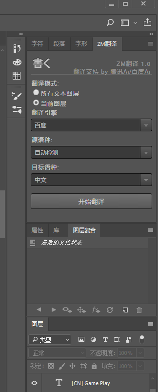
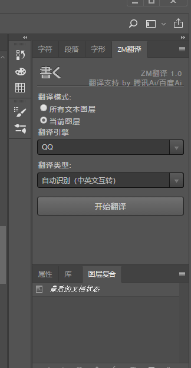

#### 项目介绍
photoshop cc2018 翻译插件，项目基于Kaku插件上修改

#### 安装使用
1. 把server中的文件放入网站目录，并在baidu_tans.php和php_aiplat_demo中trans.php配置相应的appid和appkey
2. 将com.gitee.zengde文件夹放入C:\Program Files\Common Files\Adobe\CEP\extensions中
3. 在main-full.js中修改baidu_trans.php和trans.php的url
4. 在ps中窗口-扩展功能-ZM翻译打开面板
5. 选择翻译模式-引擎-语言，开始翻译

#### 调试

1. 启动ps后，在浏览器端打开http://localhost:8088调试

#### 截图

